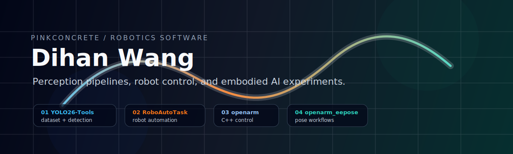

  

  
  
  
  

  Practical robotics software for automation, scene annotation, system pipelines, and non-contact sensing.

---

## Profile Signal

This profile is curated as a ranked portfolio, not a repository directory. The main order favors personal contribution, project completeness, and fit with robotics/perception systems.

<table>
  <tr>
    <td width="34%" valign="top">
      <b>Direction</b> 
      Robotics systems, scene data infrastructure, embodied AI, and sensing applications.
    </td>
    <td width="33%" valign="top">
      <b>Stack</b> 
      Python / C++ / ROS / Linux / Vue / Electron.
    </td>
    <td width="33%" valign="top">
      <b>Public shape</b> 
      Four primary projects lead the profile; utilities and older experiments stay secondary.
    </td>
  </tr>
</table>

## Main Work

<table>
  <tr>
    <td width="55%" valign="top">
      <h3>01. <a href="https://github.com/PINKCONCRETE/RoboAutoTask">RoboAutoTask</a></h3>
      
<b>Robot task automation layer.</b>

      
Python automation framework for repeatable robotic task execution, data collection, and experiment workflows.

      
<code>robotics</code> <code>automation</code> <code>task-planning</code>

    </td>
    <td width="45%" valign="top">
      <h3>02. <a href="https://github.com/PINKCONCRETE/SceneAnnotation">SceneAnnotation</a></h3>
      
<b>Scene data and annotation infrastructure.</b>

      
Annotation utilities for robotics and computer vision datasets, focused on making perception data easier to inspect and reuse.

      
<code>annotation</code> <code>dataset</code> <code>robotics</code>

    </td>
  </tr>
  <tr>
    <td width="45%" valign="top">
      <h3>03. <a href="https://github.com/PINKCONCRETE/robocoin-pipeline">robocoin-pipeline</a></h3>
      
<b>Embodied AI pipeline experiments.</b>

      
Pipeline-level robotics experiments that connect perception, planning, automation, and execution flow.

      
<code>pipeline</code> <code>embodied-ai</code> <code>automation</code>

    </td>
    <td width="55%" valign="top">
      <h3>04. <a href="https://github.com/PINKCONCRETE/Millimeter-wave-Respiratory-and-Heart-Rate-Monitoring-Device">Millimeter-wave Monitoring Device</a></h3>
      
<b>Non-contact vital-sign monitoring system.</b>

      
Graduation project for millimeter-wave respiratory and heart-rate monitoring, with Python signal processing and a Vue/Electron dashboard.

      
<code>fmcw-radar</code> <code>signal-processing</code> <code>electron</code>

    </td>
  </tr>
</table>

## Small Tools

| Tool | Role |
| --- | --- |
| [YOLO26-Tools](https://github.com/PINKCONCRETE/YOLO26-Tools) | VLM-assisted detection, GroundingDINO workflows, COCO generation, and YOLO fine-tuning utilities. |

## Working Stack

  
  
  
  
  
  

## GitHub Activity

Dynamic activity cards were removed to avoid unreliable rendering. Current public summary:

`20 public repositories` / `4 primary projects` / `small tools kept secondary` / `focus: robotics, perception, and sensing`

## Current Direction

I am tightening my public repositories around robotics infrastructure, scene data tooling, embodied AI pipelines, and practical sensing systems. Each visible project should quickly answer what it does, how to run it, and why it matters.
